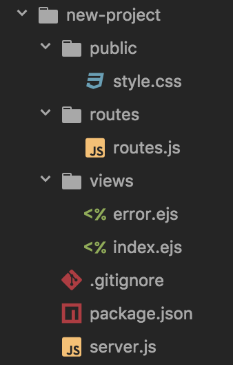

# server-bro

## What is Server-bro?

Server-bro is a CLI tool that will throw together a simple server in a new folder in whatever directory you are currently in.

## How to install server-bro

`npm install -g server-bro`

Be sure to get all of the package.json dependencies by running the following code in the command line after installing;

`npm install`

### How to use server-broC

`node server-bro server me bro`

This will create the following folder tree:

